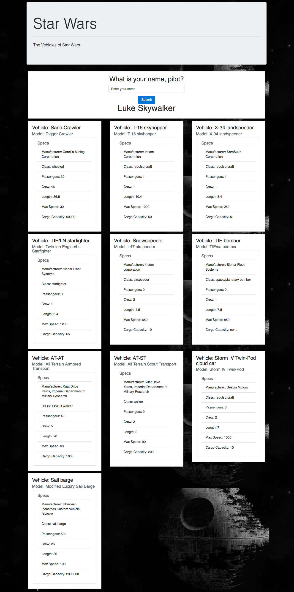

# React-Star-Wars-Vehicles
The Iron Yard 9.9 React Week 1, Day 5, Daily Project: Star Wars React App

# Star Wars React App

The Iron Yard Daily Project: Star Wars React App

## Description  

In this project, you will use the [Star Wars API (SWAPI)](http://swapi.co/documentation) to render a set of Star Wars vehicles 'cards'. To achieve this you will implement the following React logic: `props`, `state` and `lifecycle`.

## Normal Mode  

### Project Setup  

We have scaffolded the majority of the project for you! The purpose of this project is to get you familiar with the concepts of `props`, `state`, and `lifecycle` events.

There are detailed instructions in the `app.js` file located inside 'components' in the 'src' file. **Read the instructions carefully.**

The body of the page consists of three sections, a header (jumbotron), a form, and the vehicle 'cards' section.

The form needs to collect the 'pilot's' name. Your job is to set the `state` of the pilot's name upon submission so that it can be displayed right beneath the submit button.

Before you can render the vehicles, you will first have to fetch the data from the Start Wars API vehicle endpoint: https://swapi.co/api/vehicles/

Creating the vehicle cards is relatively easy using Bootstrap 4. See [docs](https://v4-alpha.getbootstrap.com/components/card/) for details.

### Props and State  

You will need to set the appropriate `props` and set the initial `state` for each of the following: 'vehicles' (empty array), 'value' (empty string. This is the initial value of the form's input), and 'pilot' (empty string.)

```jsx
constructor(props) {
  // super
  // bind handlers
  // set initial state: vehicles, value, pilot.
}
```

### Lifecycle  

As you have already learned, the best place to fetch data is in `componentDidMount`. Once the data is fetched, you will need to set it to the `state`, so that you can render each individual vehicle in the `render` method. You will need to iterate over the data in order to retrieve the values listed in `app.js`.

```jsx
componentDidMount(){
  //Fetch from Star Wars api
  // Set 'vehicles' state
}
```

### Render  

```jsx
render() {
  /*
  Store vehicles state in a variable.
  Map over this variable to access the values needed to render.
  */
  return (
    <div className="App">
      {/*
      jumbotron
      form
      vehicle cards
       */}
    </div>
  );
}
}
```

### Hint  

Before worrying about `props`, `state`, and `ifecycle`, take care of rendering the Jumbotron and the form. Then, move on to `props` and `state`, followed by `lifecycle`.

## Getting started  

Download starter files and follow directions below: 

1. Download the zip file, and place where you keep projects

2. Change directories into the project

3. Install the dependencies - `npm install`

4. Fire up the server - `npm start`

All you should see when you first run the app is an empty app with just a background.

## Hard Mode  

Try adding a 'starships' and 'people' component.

## Mockup


